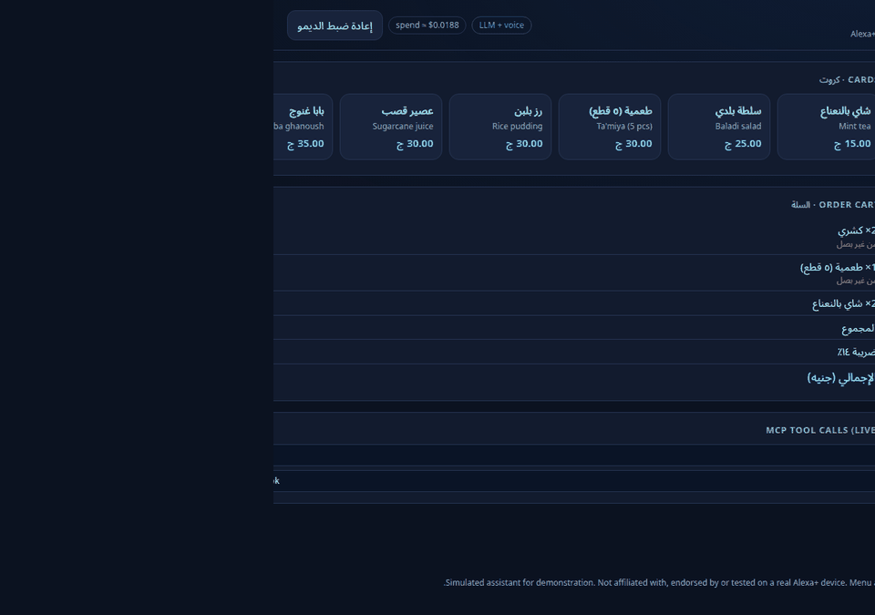
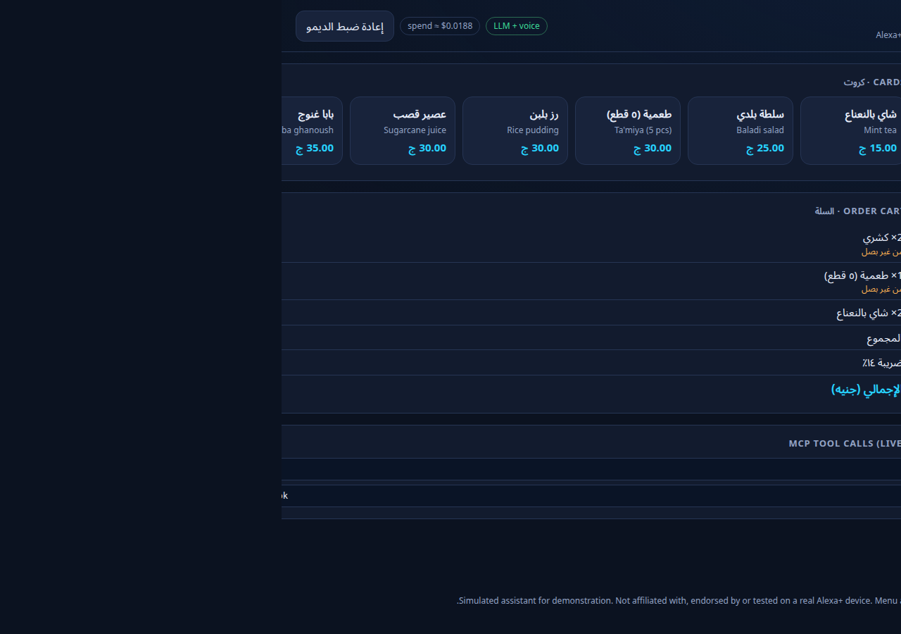
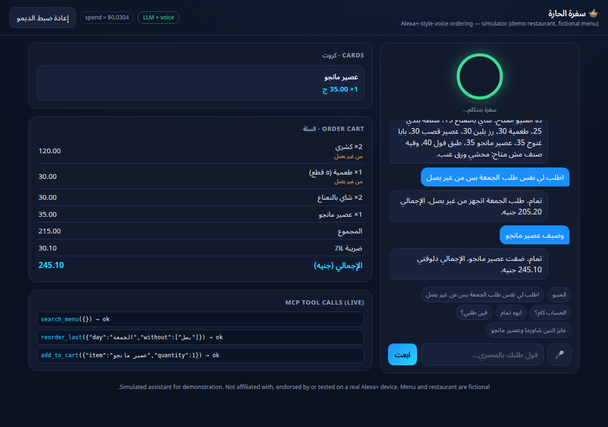
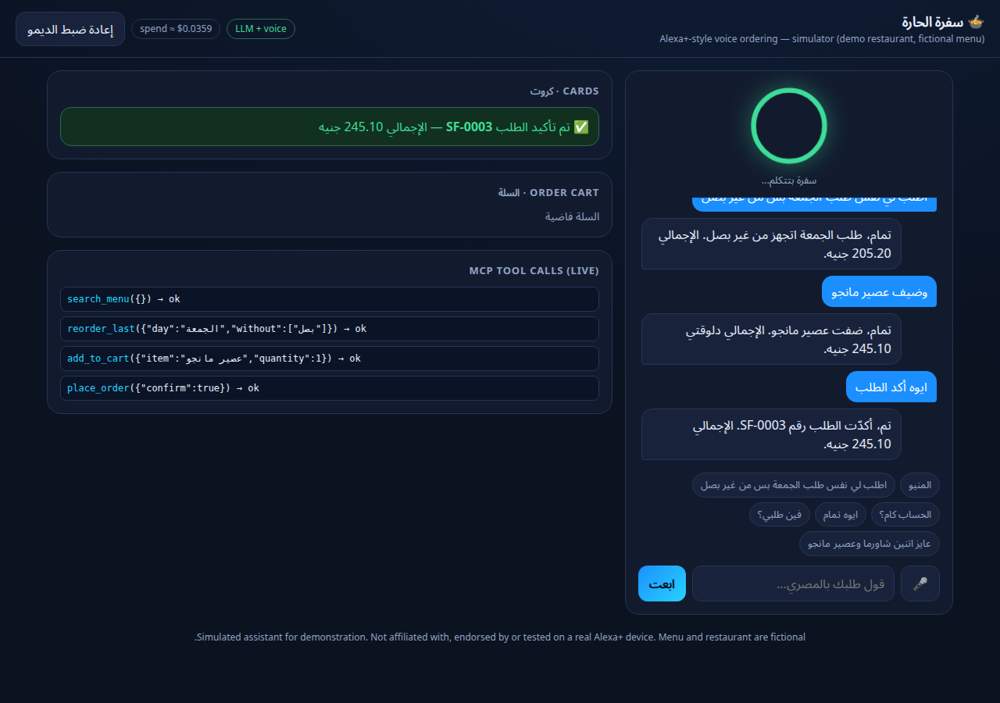
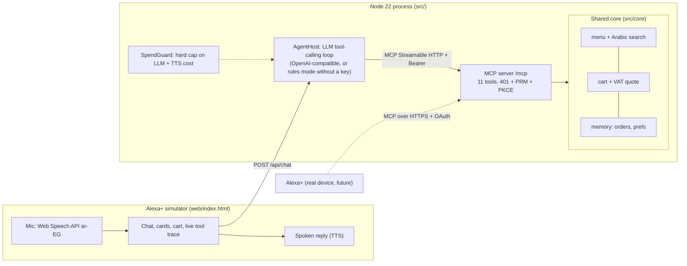

# Sufra Agent: Egyptian-Arabic restaurant ordering as an MCP server

[](LICENSE)

An **Arabic-first (Egyptian dialect) ordering agent** for restaurants, exposed as a spec-compliant
**MCP server** (Streamable HTTP, MCP `2025-11-25`) plus an **Alexa+-style voice simulator** web app.
Built for the *Amazon Developer Hackathon* (Alexa+ track), which allows simulating the Alexa+ experience in a web app.

Say, in Egyptian Arabic:

> «اطلب لي نفس طلب الجمعة بس من غير بصل» ("same as Friday, but no onions")

and the agent finds your last Friday order, drops the onions only from dishes that have onions, quotes the total with 14% VAT,
asks for confirmation, places the order and remembers it for next time.



| Reorder with a tweak | Add an item | Confirm |
|---|---|---|
|  |  |  |

Mobile layout: [docs/mobile.png](docs/mobile.png).

## What is real and what is simulated

| Real | Simulated / out of scope |
|---|---|
| MCP server, 11 tools, Streamable HTTP, protocol `2025-11-25` (asserted in tests) | No Alexa+ device or Alexa+ account was used; Alexa+ does not support Egyptian Arabic today, so the host is a web simulator |
| OAuth 2.1 authorization-code + PKCE (S256) demo flow, discovery metadata, 401 on missing token | One fictional customer, auto-approved; the access token is static. Production needs a real identity provider |
| Arabic normalisation + dialect-alias search, modifiers ("no onions"), 14% VAT in integer piasters | Menu, restaurant and customer are fictional demo data |
| Order memory across sessions (JSON file), weekday / "yesterday" resolution in Cairo time | No payment (the PayPal entry adds checkout) and no real kitchen: order status is derived from elapsed time |
| LLM host with tool calling through MCP, TTS voice, browser speech recognition (Chrome, `ar-EG`) | Speech input needs Chrome; typed input works everywhere |

## Architecture



* `src/core/` pure, tested logic: no network, reusable by other front ends (payments, other LLM providers).
* `src/mcp/` the MCP server (`server.ts` tools, `auth.ts` OAuth/PKCE demo).
* `src/agent/` the host used by the simulator: `llm.ts` (OpenAI-compatible client + spend cap), `rules.ts` (deterministic Egyptian-Arabic parser used without an API key and in tests), `host.ts` (loop that calls tools **through MCP**, so the simulator exercises the same server an Alexa+ client would).
* `web/index.html` the simulator, single static file, no build step.

### MCP tools

`search_menu`, `add_to_cart`, `remove_from_cart`, `get_cart`, `quote_total`, `place_order` (needs `confirm: true`), `order_status`, `order_history`, `reorder_last` (weekday / "امبارح", `without`, `add`), `get_preferences`, `set_preference`.
Every result carries a short Egyptian-Arabic sentence plus `structuredContent` for cards.

## Setup

Requires Node 22+.

```bash
git clone https://github.com/alf7ar/sufra-agent && cd sufra-agent
npm install
npm test            # 26 tests, no API key or network needed
npm start           # http://127.0.0.1:8787  (simulator at /, MCP at /mcp)
```

Without a key the simulator runs in **rules mode** (deterministic parser). For LLM + voice:

```bash
cp .env.example .env          # then export the variables, e.g.  set -a; . ./.env; set +a
export OPENAI_API_KEY=...     # your own key; never commit it
npm start
```

`SUFRA_SPEND_CAP_USD` (default 2) is a hard cap on estimated LLM + TTS spend, tracked in `data/openai_cost.jsonl`.
`SUFRA_LLM_BASE_URL` points the host at any OpenAI-compatible endpoint.

### Try the MCP server directly

```bash
curl -s http://127.0.0.1:8787/mcp -H 'authorization: Bearer sufra-demo-token' \
  -H 'content-type: application/json' -H 'accept: application/json, text/event-stream' \
  -d '{"jsonrpc":"2.0","id":1,"method":"tools/list"}'
```

Or with the MCP Inspector: `npx @modelcontextprotocol/inspector` and connect to `http://127.0.0.1:8787/mcp` (Streamable HTTP) with the header `Authorization: Bearer sufra-demo-token`.

### Expose it to Alexa+ (remote HTTPS URL)

Alexa+ needs a public HTTPS URL: `cloudflared tunnel --url http://127.0.0.1:8787`, then use the printed URL.
Discovery endpoints served: `/.well-known/oauth-protected-resource`, `/.well-known/oauth-authorization-server` (S256), `/authorize`, `/token`.
Only Alexa account-linking redirect hosts and localhost are accepted as `redirect_uri` (`SUFRA_ALLOWED_REDIRECT_HOSTS`).
Set `SUFRA_BEARER_TOKEN` to a random value if you expose the server.

## Tests

```
 Test Files  3 passed (3)
      Tests  26 passed (26)
```

* `test/core.test.ts` Arabic normalisation, alias search, availability, modifiers, VAT, "same as Friday, no onions", persistence.
* `test/mcp.test.ts` real HTTP server + official MCP SDK client: protocol `2025-11-25`, tool list, full order flow, memory across sessions, 401 handling, PKCE flow (wrong verifier / reused code / disallowed redirect rejected).
* `test/agent.test.ts` Egyptian-Arabic intent parser, the host loop through MCP, spend cap.

## Shared core and what is new for this hackathon

All code in this repository was written during the Amazon Developer Hackathon submission period (from 7 Oct 2026) using demo data only.
The reusable part is `src/core` (menu, cart, quote, memory) plus the `Llm` interface in `src/agent/llm.ts`; the Alexa+-specific part is the MCP server with OAuth/PKCE and the simulator.
The same core is intended to be reused by separate, distinct projects for other hackathons (a payments layer, a different LLM provider); each will be its own repository and submission.

## Friction log

See [docs/FRICTION_LOG.md](docs/FRICTION_LOG.md).

## Limits and honesty

* Not tested on a real Alexa+ device. Alexa+ availability in Egypt and Arabic (Egyptian dialect) support are not confirmed; the simulator stands in for it.
* Order state lives in a local JSON file; there is no concurrency control, multi-tenant isolation or real POS integration.
* LLM replies depend on the model; the rules mode is a fallback, not a language-understanding system.

## License

MIT, see [LICENSE](LICENSE).
